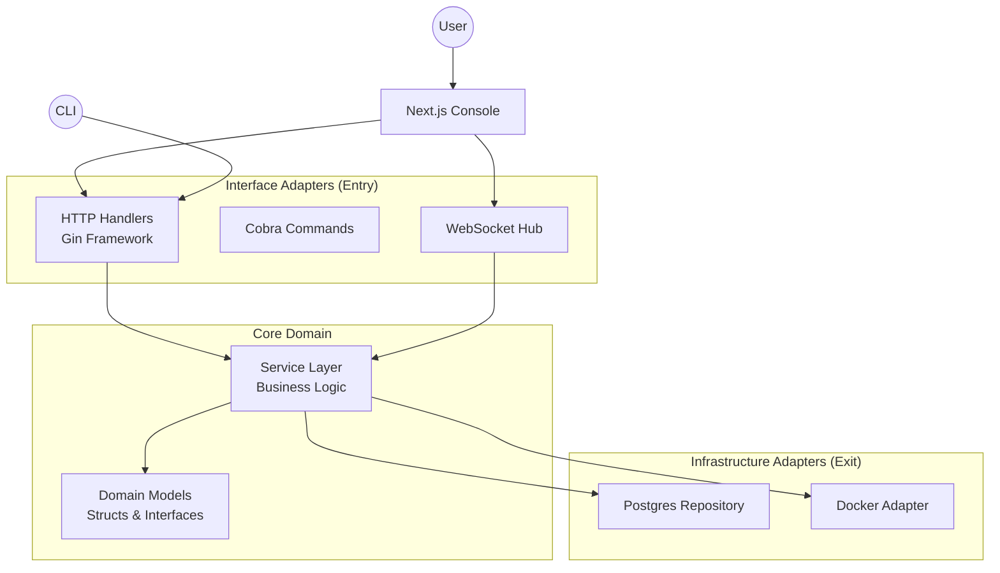

# System Architecture

## Overview
The Cloud is built using **Hexagonal Architecture** (also known as Ports and Adapters). This design allows the core business logic to remain isolated from external concerns like the database, HTTP transport, or Docker infrastructure.

## High-Level Diagram



## Layers

### 1. Domain Layer (`internal/core/domain`)
- **Responsibility**: Defines the core entities and state of the system.
- **Dependencies**: None. Pure Go.
- **Example**: `Instance` struct with status constants.

### 2. Ports Layer (`internal/core/ports`)
- **Responsibility**: Defines the *interfaces* (contracts) for how the outside world interacts with the core (Primary Ports) and how the core interacts with infrastructure (Secondary Ports).
- **Dependencies**: Imports Domain.

### 3. Service Layer (`internal/core/services`)
- **Responsibility**: Implements the business logic (Primary Ports). Controls the flow of data.
- **Dependencies**: Imports Domain and Ports.

### 4. Adapter Layer (`internal/repositories`, `internal/handlers`)
- **Responsibility**: Implements the interfaces. Connects to real "dirty" details like SQL or Docker APIs.
- **Dependencies**: Imports Ports and Domain.

### 5. Background Workers
- **LBWorker**: Periodically checks health of LB targets and manages proxy containers.
- **AutoScalingWorker**: Evaluates scaling policies and adjusts group sizes (scale-out/scale-in) asynchronously.
- **MetricCollector**: Collects and archives instance stats.

## Key Design Decisions

### Dependency Injection
We use **Constructor Injection** to wire up dependencies in `main.go`.
- Services accept Repository Interfaces.
- Handlers accept Service Interfaces.

This makes testing easy, as we can inject mock repositories into the services.

### Error Handling
We use a custom error strategy (to be implemented) where domain errors are mapped to HTTP status codes at the Handler layer, preventing HTTP logic from leaking into the Service layer.

### Testing Strategy

The hexagonal architecture provides excellent testability:

**Unit Testing** (51.3% overall coverage):
- **Services** (55.4%): Test business logic with mocked repositories
- **Handlers** (52.8%): Test HTTP endpoints with mocked services
- **Repositories** (57.5%): Integration tests with real PostgreSQL

**Benefits of This Architecture for Testing**:
1. **Isolation**: Each layer can be tested independently
2. **Mocking**: Interfaces make it easy to create test doubles
3. **Fast Tests**: Unit tests run without external dependencies
4. **Integration Tests**: Repository tests verify real database interactions

**Test Organization**:
```
internal/
├── core/
│   └── services/
│       ├── *_test.go          # Unit tests
│       └── shared_test.go     # Mock definitions
├── handlers/
│   └── *_test.go              # HTTP handler tests
└── repositories/
    └── postgres/
        └── *_test.go          # Integration tests (//go:build integration)
```

See [Backend Guide](backend.md#testing) for detailed testing documentation.
