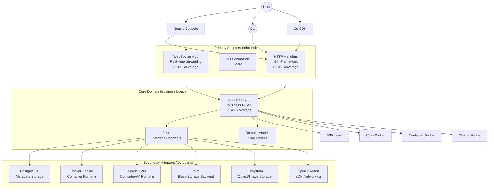

# System Architecture

## Overview

The Cloud is built using **Hexagonal Architecture** (Ports and Adapters pattern), which provides:
- **Independence**: Core business logic isolated from infrastructure
- **Testability**: Easy to mock and test each layer independently (51.3% coverage)
- **Flexibility**: Swap implementations without changing business logic
- **Maintainability**: Clear separation of concerns

## Architecture Diagram



## Architectural Layers

### 1. Domain Layer (`internal/core/domain`)

**Responsibility**: Pure business entities and value objects

**Characteristics**:
- No external dependencies
- No framework imports
- Pure Go structs and constants
- Represents the ubiquitous language

**Examples**:
```go
type Instance struct {
    ID        uuid.UUID
    UserID    uuid.UUID
    Name         string
    Image        string
    InstanceType string
    Status       InstanceStatus
    CreatedAt    time.Time
}

type InstanceStatus string
const (
    StatusStarting InstanceStatus = "starting"
    StatusRunning  InstanceStatus = "running"
    StatusStopped  InstanceStatus = "stopped"
)
```

**Key Entities**:
- `Instance`, `InstanceType`, `Volume`, `VPC`, `LoadBalancer`
- `Function`, `Queue`, `Topic`, `CronJob`
- `User`, `Role`, `APIKey`, `Secret`
- `ScalingGroup`, `ScalingPolicy`

### 2. Ports Layer (`internal/core/ports`)

**Responsibility**: Interface definitions (contracts)

**Primary Ports** (inbound - what the application offers):
```go
type InstanceService interface {
    LaunchInstance(ctx context.Context, name, image, ports, instanceType string, vpcID, subnetID *uuid.UUID, volumes []domain.VolumeAttachment) (*domain.Instance, error)
    List(ctx context.Context) ([]*domain.Instance, error)
    Stop(ctx context.Context, id uuid.UUID) error
    Terminate(ctx context.Context, id uuid.UUID) error
}
```

**Secondary Ports** (outbound - what the application needs):
```go
type InstanceRepository interface {
    Create(ctx context.Context, inst *domain.Instance) error
    GetByID(ctx context.Context, id uuid.UUID) (*domain.Instance, error)
    Update(ctx context.Context, inst *domain.Instance) error
    Delete(ctx context.Context, id uuid.UUID) error
}

type ComputeBackend interface {
    CreateInstance(ctx context.Context, name, imageName string, ports []string, networkID string, volumeBinds []string, env []string, cmd []string) (string, error)
    StopInstance(ctx context.Context, id string) error
    DeleteInstance(ctx context.Context, id string) error
    AttachVolume(ctx context.Context, id string, volumePath string) error
    DetachVolume(ctx context.Context, id string, volumePath string) error
    GetConsoleURL(ctx context.Context, id string) (string, error)
}

type StorageBackend interface {
    CreateVolume(ctx context.Context, name string, sizeGB int) (string, error)
    DeleteVolume(ctx context.Context, name string) error
    CreateSnapshot(ctx context.Context, volumeName, snapshotName string) error
    RestoreSnapshot(ctx context.Context, volumeName, snapshotName string) error
}
```

### 3. Service Layer (`internal/core/services`)

**Responsibility**: Business logic and orchestration

**Coverage**: 55.4%

**Characteristics**:
- Implements Primary Ports
- Depends on Secondary Ports (interfaces only)
- Contains all business rules
- Orchestrates multiple repositories
- Handles transactions and error handling

**Core Services**:
- `InstanceService` - Compute lifecycle
- `VolumeService` - Block storage
- `VPCService` - Network isolation
- `ElasticIPService` - Static IP management 🆕
- `LoadBalancerService` - Traffic distribution (Regional)
- `GlobalLBService` - Multi-region traffic steering (DNS-based) 🆕
- `AutoScalingService` - Dynamic scaling
- `RBACService` - Access control (100% coverage)
- `FunctionService` - Serverless execution
- `QueueService` - Message queuing
- `NotifyService` - Pub/Sub messaging
- `CronService` - Scheduled tasks
- `SecretService` - Encrypted storage

**Example Service**:
```go
type instanceService struct {
    repo         ports.InstanceRepository
    computeAdapter ports.ComputeAdapter
    eventSvc     ports.EventService
    auditSvc     ports.AuditService
}

func (s *instanceService) Launch(ctx context.Context, req LaunchRequest) (*domain.Instance, error) {
    // 1. Validate request
    if err := req.Validate(); err != nil {
        return nil, errors.New(errors.InvalidInput, err.Error())
    }
    
    // 2. Create instance record
    inst := &domain.Instance{
        ID:     uuid.New(),
        UserID: appcontext.UserIDFromContext(ctx),
        Name:   req.Name,
        Status: domain.StatusStarting,
    }
    
    if err := s.repo.Create(ctx, inst); err != nil {
        return nil, err
    }
    
    // 3. Launch container/VM
    containerID, err := s.computeAdapter.CreateContainer(ctx, config)
    if err != nil {
        return nil, err
    }
    
    // 4. Record event
    _ = s.eventSvc.RecordEvent(ctx, "INSTANCE_LAUNCHED", inst.ID.String(), "INSTANCE", nil)
    
    // 5. Audit log
    _ = s.auditSvc.Log(ctx, inst.UserID, "instance.launch", "instance", inst.ID.String(), nil)
    
    return inst, nil
}
```

### 4. Handler Layer (`internal/handlers`)

**Responsibility**: HTTP transport and request/response handling

**Coverage**: 52.8%

**Characteristics**:
- Implements REST API endpoints
- Validates HTTP requests
- Maps domain errors to HTTP status codes
- Returns JSON responses
- No business logic

**Example Handler**:
```go
type InstanceHandler struct {
    svc ports.InstanceService
}

func (h *InstanceHandler) Launch(c *gin.Context) {
    var req LaunchRequest
    if err := c.ShouldBindJSON(&req); err != nil {
        httputil.Error(c, errors.New(errors.InvalidInput, err.Error()))
        return
    }
    
    inst, err := h.svc.Launch(c.Request.Context(), req)
    if err != nil {
        httputil.Error(c, err)
        return
    }
    
    httputil.Success(c, http.StatusCreated, inst)
}
```

**WebSocket Handlers** (81.6% coverage):
- Real-time log streaming
- Live metrics updates
- Event notifications

### 5. Repository Layer (`internal/repositories`)

**Responsibility**: Infrastructure adapters for data persistence

**Coverage**: 57.5% (PostgreSQL)

**PostgreSQL Repositories**:
- User, Role, APIKey management
- Instance, Volume, VPC metadata
- Function, Queue, Topic state
- Audit logs and events

**OVS Adapter**:
- SDN management (Bridges, Ports, Flow rules)
- VXLAN tunnel orchestration
- IPAM and veth plumbing for instances

**Example Repository**:
```go
type instanceRepository struct {
    db *pgxpool.Pool
}

func (r *instanceRepository) Create(ctx context.Context, inst *domain.Instance) error {
    query := `
        INSERT INTO instances (id, user_id, name, image, status, created_at)
        VALUES ($1, $2, $3, $4, $5, $6)
    `
    _, err := r.db.Exec(ctx, query,
        inst.ID, inst.UserID, inst.Name, inst.Image, inst.Status, inst.CreatedAt,
    )
    return err
}
```

### 6. Background Workers

**AutoScaling Worker**:
- Evaluates scaling policies every 30 seconds
- Triggers scale-out/scale-in based on metrics
- Manages instance lifecycle

**Container Worker**:
- Monitors container health
- Auto-heals failed containers
- Maintains desired replica count

**Cron Worker**:
- Executes scheduled tasks
- Records execution history
- Handles failures and retries

**Cluster Worker**:
- Handles long-running Kubernetes operations (Provision, Deprovision, Upgrade)
- Consumes jobs from a Redis-backed **Task Queue**
- Ensures operations are durable and can resume after system restarts
- Manages complex multi-node coordination for HA clusters

## Key Design Principles

### 1. Dependency Inversion

**Rule**: High-level modules should not depend on low-level modules. Both should depend on abstractions.

```go
// ✅ Good: Service depends on interface
type instanceService struct {
    repo ports.InstanceRepository  // Interface, not concrete type
}

// ❌ Bad: Service depends on concrete implementation
type instanceService struct {
    repo *postgres.InstanceRepository  // Concrete type
}
```

### 2. Dependency Injection

All dependencies are injected via constructors in `main.go`:

```go
// Repositories
instanceRepo := postgres.NewInstanceRepository(db)
dockerAdapter := docker.NewDockerAdapter(dockerClient)

// Services
instanceSvc := services.NewInstanceService(instanceRepo, dockerAdapter, eventSvc, auditSvc)

// Handlers
instanceHandler := handlers.NewInstanceHandler(instanceSvc)

// Routes
api.POST("/instances", instanceHandler.Launch)
```

### 3. Context Propagation

Every operation accepts `context.Context` as the first parameter:

```go
func (s *Service) Method(ctx context.Context, params...) (result, error)
```

**Benefits**:
- Request cancellation
- Timeout handling
- User ID propagation
- Distributed tracing
- Deadline enforcement

### 4. Error Handling

Custom error package with domain-specific error codes:

```go
// Define error
if instance == nil {
    return errors.New(errors.NotFound, "instance not found")
}

// Wrap error
if err := repo.Create(ctx, inst); err != nil {
    return errors.Wrap(errors.Internal, "failed to create instance", err)
}

// Map to HTTP status in handler
func (h *Handler) handleError(c *gin.Context, err error) {
    switch errors.GetCode(err) {
    case errors.NotFound:
        c.JSON(404, gin.H{"error": err.Error()})
    case errors.Unauthorized:
        c.JSON(401, gin.H{"error": err.Error()})
    default:
        c.JSON(500, gin.H{"error": "internal server error"})
    }
}
```

## Testing Strategy

### Why This Architecture Enables Great Testing

1. **Layer Isolation**: Each layer can be tested independently
2. **Interface Mocking**: Easy to create test doubles
3. **No External Dependencies**: Unit tests run fast
4. **Integration Points**: Clear boundaries for integration tests

### Test Coverage (51.3% Overall)

| Layer | Coverage | Test Type | Location |
|-------|----------|-----------|----------|
| Services | 55.4% | Unit | `internal/core/services/*_test.go` |
| Handlers | 52.8% | Unit | `internal/handlers/*_test.go` |
| Repositories | 57.5% | Integration | `internal/repositories/postgres/*_test.go` |
| WebSocket | 81.6% | Unit | `internal/handlers/ws/*_test.go` |
| Errors | 100% | Unit | `internal/errors/*_test.go` |
| Context | 100% | Unit | `internal/core/context/*_test.go` |

### Testing Patterns

**Service Layer Testing** (with mocks):
```go
func TestInstanceService_Launch(t *testing.T) {
    repo := new(MockInstanceRepo)
    adapter := new(MockComputeAdapter)
    svc := services.NewInstanceService(repo, adapter, nil, nil)
    
    repo.On("Create", ctx, mock.Anything).Return(nil)
    adapter.On("CreateContainer", ctx, mock.Anything).Return("container-id", nil)
    
    inst, err := svc.Launch(ctx, req)
    
    require.NoError(t, err)
    assert.NotNil(t, inst)
    repo.AssertExpectations(t)
    adapter.AssertExpectations(t)
}
```

**Handler Layer Testing** (with mocked services):
```go
func TestInstanceHandler_Launch(t *testing.T) {
    gin.SetMode(gin.TestMode)
    svc := new(MockInstanceService)
    handler := NewInstanceHandler(svc)
    
    svc.On("Launch", mock.Anything, mock.Anything).Return(&domain.Instance{}, nil)
    
    w := httptest.NewRecorder()
    c, _ := gin.CreateTestContext(w)
    c.Request = httptest.NewRequest("POST", "/instances", body)
    
    handler.Launch(c)
    
    assert.Equal(t, 201, w.Code)
}
```

**Repository Layer Testing** (integration tests):
```go
//go:build integration

func TestInstanceRepository_Create(t *testing.T) {
    db := setupDB(t)
    defer db.Close()
    repo := NewInstanceRepository(db)
    ctx := setupTestUser(t, db)
    
    inst := &domain.Instance{
        ID:     uuid.New(),
        UserID: userID,
        Name:   "test-instance",
    }
    
    err := repo.Create(ctx, inst)
    require.NoError(t, err)
    
    fetched, err := repo.GetByID(ctx, inst.ID)
    require.NoError(t, err)
    assert.Equal(t, inst.Name, fetched.Name)
}
```

## Benefits of This Architecture

### 1. Testability
- **51.3% test coverage** achieved through clean separation
- Unit tests run in milliseconds
- Integration tests verify real database interactions
- Easy to mock any layer

### 2. Maintainability
- Clear boundaries between layers
- Changes in one layer don't affect others
- Easy to understand and navigate

### 3. Flexibility
- Swap PostgreSQL for MySQL without changing services
- Switch from Docker to Kubernetes without changing business logic
- Add new transport layers (gRPC, GraphQL) easily

### 4. Scalability
- Services can be extracted into microservices
- Each layer can scale independently
- Background workers run asynchronously

### 5. Team Collaboration
- Frontend team works on handlers
- Backend team works on services
- Infrastructure team works on repositories
- Clear contracts (interfaces) between teams

## Common Patterns

### 1. Repository Pattern
All data access goes through repositories:
```go
type Repository interface {
    Create(ctx context.Context, entity *Entity) error
    GetByID(ctx context.Context, id uuid.UUID) (*Entity, error)
    Update(ctx context.Context, entity *Entity) error
    Delete(ctx context.Context, id uuid.UUID) error
}
```

### 2. Service Pattern
Business logic lives in services:
```go
type Service interface {
    PerformBusinessOperation(ctx context.Context, req Request) (*Response, error)
}
```

### 3. Handler Pattern
HTTP concerns stay in handlers:
```go
func (h *Handler) Endpoint(c *gin.Context) {
    // 1. Parse request
    // 2. Call service
    // 3. Return response
}
```

## Anti-Patterns to Avoid

❌ **Don't**: Put business logic in handlers
❌ **Don't**: Import repositories directly in handlers
❌ **Don't**: Put HTTP concerns in services
❌ **Don't**: Use concrete types instead of interfaces
❌ **Don't**: Skip context propagation

✅ **Do**: Keep layers independent
✅ **Do**: Use dependency injection
✅ **Do**: Test each layer separately
✅ **Do**: Follow the dependency rule
✅ **Do**: Use interfaces for all dependencies

## Further Reading

- [Backend Guide](backend.md) - Detailed implementation guide
- [Development Guide](development.md) - Setup and testing
- [Database Guide](database.md) - Schema and migrations
- [Testing Best Practices](backend.md#testing) - Comprehensive testing guide
