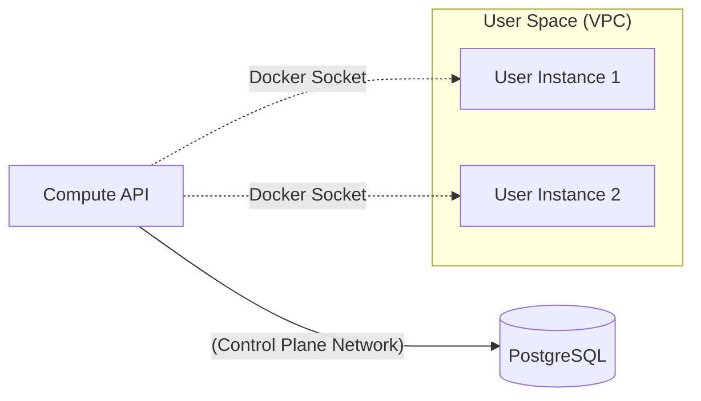

# Cloud Infrastructure Guide

This document covers the infrastructure and DevOps aspects of Mini AWS.

## The Docker Adapter (`internal/repositories/docker`)

The "Compute" service acts as a hypervisor. Instead of launching VMs (KVM/QEMU), it launches **Docker Containers** that act as instances.

### How it works
1.  **Pull**: Logic uses `client.ImagePull` to ensure the requested image (e.g., `nginx`) exists.
2.  **Create**: Uses `client.ContainerCreate`.
3.  **Start**: Uses `client.ContainerStart`.

### Current Limitations
- **Networking**: All instances are currently attached to the default bridge. In the future, every "Account" will ideally have its own Docker Network (VPC simulation).
- **Isolation**: No CPU/Memory limits are enforced yet. This will be added in the `Scaling` phase.

## Environment Variables

| Variable | Description | Default |
|----------|-------------|---------|
| `PORT` | API Server Port | `:8080` |
| `DB_DSN` | Postgres Connection String | `host=localhost ...` |
| `GODAEMON` | (Internal) Docker Socket | `/var/run/docker.sock` |

## Deployment Strategy

### Docker Compose
We use `docker-compose.yml` to orchestrate the control plane.
- **Service**: `postgres` (State)
- **Service**: `compute-api` (Logic)

### Mounting the Socket
To let the `compute-api` container launch *sibling* containers, we mount the host Docker socket:
```yaml
volumes:
  - /var/run/docker.sock:/var/run/docker.sock
```
*Note: This is a security risk in production but acceptable for a local learning simulator.*

## Network Architecture (Planned)


